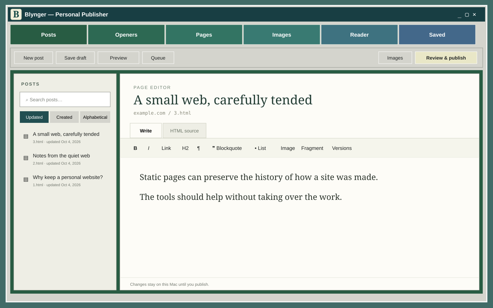

# Blynger

**Blynger is a static personal website manager with Blygger interoperability built in.**

Blynger is a local Mac application for writing, maintaining, reading from, and publishing a hand-built static website. It preserves ordinary HTML files and Git publication while adding Blyg 0.3 items, fragments, threads, transclusions, stubs, forks, pins, a local Reader, and separate ordinary/Blyg RSS feeds.

For a fuller explanation of the static-first design and how its workspaces and
Blyg features fit together, see [How Blynger Works](HOW_BLYNGER_WORKS.md).



### History

Blynger started as an app to automate updating a handcoded website built to run on the no-frills webhosting service, NearlyFreeSpeech.net. When Blygger was released, scope expanded to make the site partly static and partly a Blygger compliant blog.
Blynger was originally built to manage bradydale.com, which remains its primary real-world test site. It would be very interesting to see if others find Blynger useful.

### Two kinds of posts

The code distinguishes between two kinds of updates:
- Posts are individual HTML pages with headlines, numbered filenames, homepage links, version history, fragments, and normal post tools.
- Openers are shorter, headline-free entries collected on openers.html. Each dated entry gets its own Blyg identity and standalone permalink even though it remains part of the aggregate page.
- Either can become a response thread when created as a Stub.
- The idea is that Openers are for one continuous page of quick updates or short thoughts, whereas Posts are for more fully developed ideas.

## Current status

Blynger is pre-1.0 software. It was built around one established static site and is being generalized for other installations. Back up a site before trying it, review every proposed publication, and expect setup work. The application never needs a private key's contents; settings store only the path to a key chosen by the operator.

## Requirements

- macOS
- Python 3
- Git
- A static HTML website in its own Git repository

Install the Python dependencies from `requirements.txt`, copy
`settings.example.json` to
`~/Library/Application Support/Blynger/settings.json`, and replace every example
value. The website, private Blynger data, and application source should be three
separate directories.

Run the local browser version with:

```sh
python3 app.py
```

The native wrapper source is in `native/Main.swift`. A packaged public Mac build
and guided first-run setup are not yet provided.

## Safety model

- Drafts, Reader state, settings, IDs, and history stay in the configured private
  data directory.
- Publishing presents an explicit file review before committing or pushing.
- Tests use disposable sites and local bare Git repositories.
- The server binds to `127.0.0.1` and uses a per-launch request token.
- `settings.json`, private data, credentials, and website content do not belong
  in this repository.

## Blygger

Blynger targets the living Blyg 0.3 Level 2 specification. See
<https://blygger.org/spec/0.3/> and the local interoperability notes in
`QUOTING.md`, `FRAGMENTS.md`, `OPENERS.md`, and `READER.md`.

## Acknowledgments

Blynger was conceived and directed by Brady Dale, and its code was written by
ChatGPT/Codex.

The open-source [Blygger Studio](https://github.com/blygger/blygger-studio)
project is an important reference client and source of implementation ideas.
Blynger credits adapted work in its changelog and remains an independent
application; reused ideas and code remain subject to their applicable license.

## Tests

```sh
python3 -m unittest discover -v
```

## License

MIT. See `LICENSE`.
